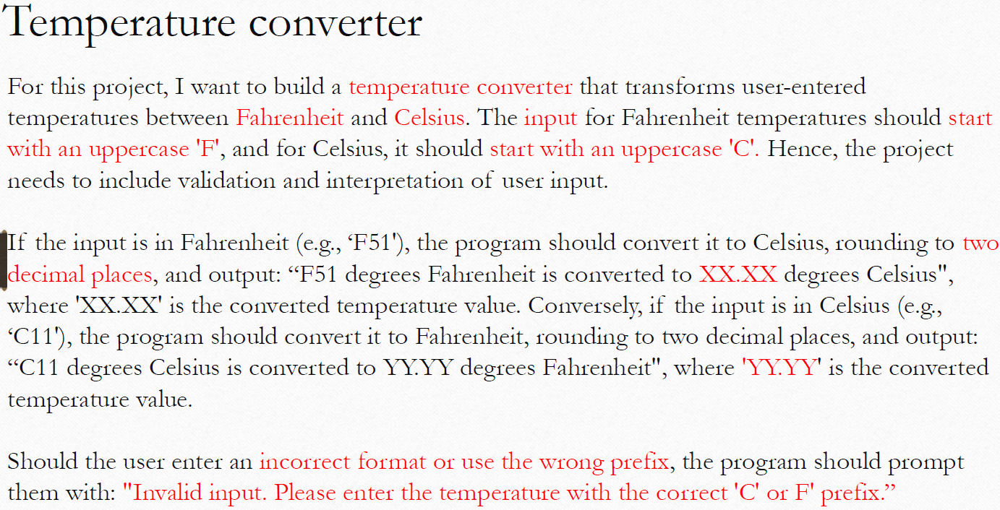
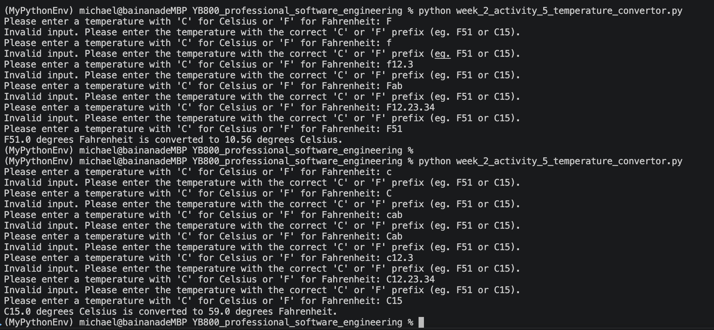

Shuohui Liu (Michael) @YooBee learning
## Week 1-2
- [Fibonacci and factorial calculation](print_fibonacci.py)
- [Problmes of average, sum, production and bmi](week_1_to_2_exercise_1.py)

## Week 2
- [Transform BMI to class](week_2_activity_1_update_bmi.py)
- [Optimized bmi calculation (Use `self` instead of `this`)](week_2_activity_1_2_optimisation_bmi.py)
    ```
    Actually, no matter self or this, both have same running because self is not a reserved keyword in Python, just as a commonly definition.
    ```
- [Make comments step by step](week_2_activity_2_update_to_oop_Word_G.py)
    
    ```
    Week2. Activity 2: Update the code to be OOP for the attached file

    See the attached file and update it to align with OOP principles. 
    Add appropriate inline comments to explain the code. 
    Share your GitHub link by tomorrow at 8:00 AM
    ```
- [Week 2 - Activity 5: Develop an OOP python project - temperature convertor - Due date: 8:00 AM -15 Aug 2026](week_2_activity_5_temperature_convertor.py)

    **Activity descriptions:**
    
    **Testing result:**
    