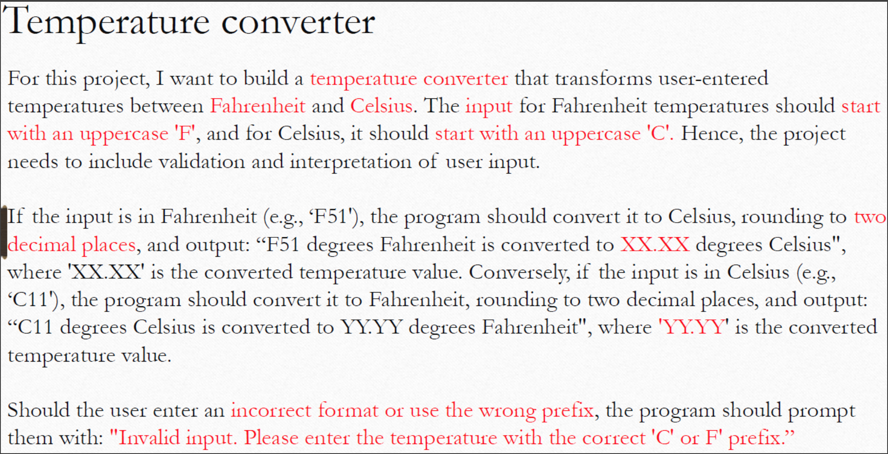
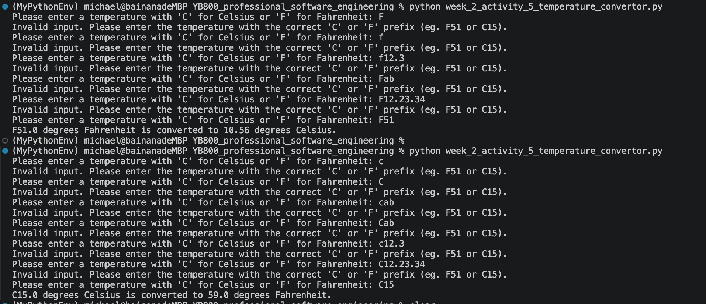
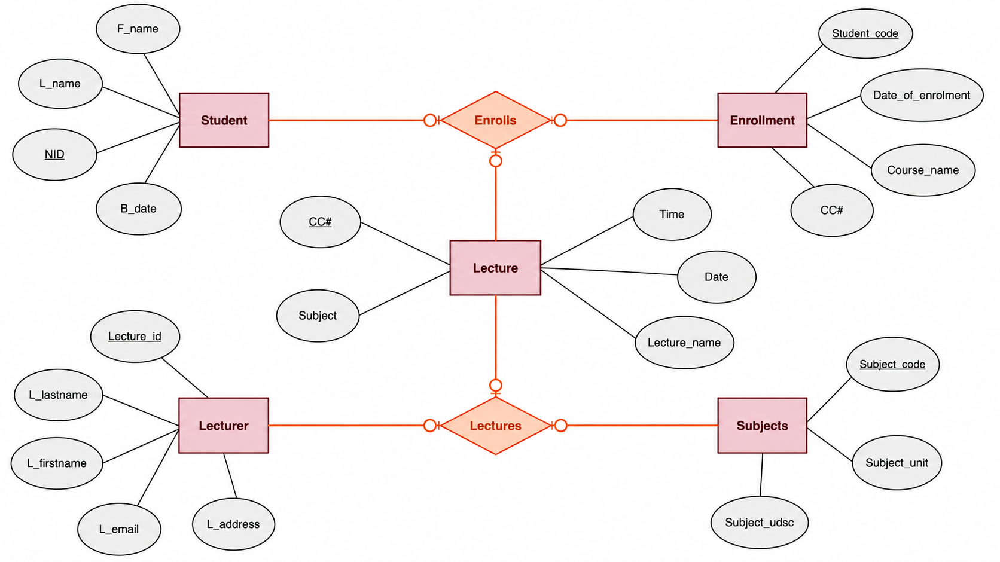

Shuohui Liu (Michael) @YooBee learning
## Week 1-2
- [Fibonacci and factorial calculation](print_fibonacci.py)
- [Problmes of average, sum, production and bmi](week_1_to_2_exercise_1.py)

## Week 2
- [Transform BMI to class](week_2_activity_1_update_bmi.py)
- [Optimized bmi calculation (Use `self` instead of `this`)](week_2_activity_1_2_optimisation_bmi.py)
    ```
    Actually, no matter self or this, both have same running because self is not a reserved keyword in Python, just as a commonly definition.
    ```
- [Make comments step by step](week_2_activity_2_update_to_oop_Word_G.py)
    
    ```
    Week2. Activity 2: Update the code to be OOP for the attached file

    See the attached file and update it to align with OOP principles. 
    Add appropriate inline comments to explain the code. 
    Share your GitHub link by tomorrow at 8:00 AM
    ```
- [Week 2 - Activity 5: Develop an OOP python project - temperature convertor - Due date: 8:00 AM -15 Aug 2026](week_2_activity_5_temperature_convertor.py)

    **Activity descriptions:**
    
    **Testing result:**
    

## Week 3
- [Week 3- Activity 1: File data processing](week_3_activity_1_file_data_processing.py)
    ```
    Open the Iris dataset (https://archive.ics.uci.edu/dataset/53/iris) and perform the initial data processing to identify:
    Open the file and find the total number of records in the file.
    The total number of different flower available.
    The names of all different flowers in the dataset.
    ```

- [Week 3- Activity 2: .txt file data analysis - Junk file](week_3_activity_2_read_junk_file.py)
    ```
    Open, read, and process the attached data file. Use the attached `junk.txt` file to:
    1. Calculate and report the total number of lines in the file.
    2. Add a new line at the end of the file containing exactly: `text file nanalyssis`
    3. Convert all text in the `junk.txt` file to lowercase.
    4. Save the processed file. Share your GitHub repository link here once you have completed the task.
    ```

- [Week 3 - Activity 3: Describe ER](week_3_activity_3&4_describe_er/DESCRIPTION.md)
    ```
    Describe a scenario in one or two paragraphs in short the below ER and answer the following question based on your understanding and your own words and answer below quetions:
    add more one/ two attributes for any of the entities?
    Write the type of relationship between the entities and describe it.
    Share your file using the GitHub link.
    ```
    

- [Week 3 - Activity 4: SQLite3 project](week_3_activity_3&4_describe_er/db/)
    ```
    Develop a database project based on the ER diagram created in W3-A3. Review and update the ER diagram if necessary before implementing the database and you can use the sample code in your Blackboard.
    Populate the database with the following sample data:
        - 3 courses
        - 2 lecturers
        - 5 students
    Appropriate enrolment records for the students
    Any additional records required for the other entities/tables in your ER diagram
    Once the database has been developed and populated, use SQL queries to answer the following questions:
    How many students are registered in each course?
    List the names and student IDs of students who have enrolled in more than one course.
    ```