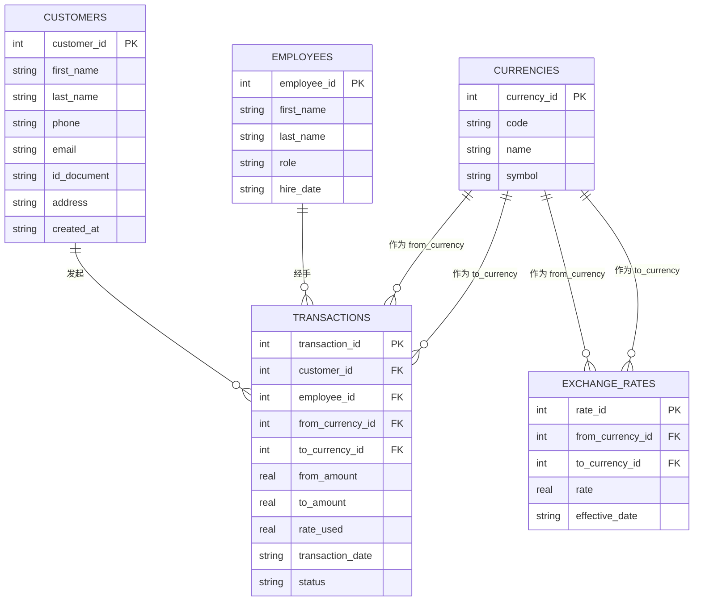

# Money Exchange System（货币兑换管理系统）

一个用 Python（面向对象风格）+ SQLite 实现的货币兑换业务数据库项目。
支持管理客户、货币、汇率、员工，并执行/记录一笔完整的兑换交易。

## 目录结构

```
money-exchange-system/
├── src/
│   ├── __init__.py
│   ├── database.py      # 数据库连接与建表（Schema）
│   ├── models.py         # 5 个实体类（Customer / Currency / Employee / ExchangeRate / Transaction）
│   └── exceptions.py     # 自定义业务异常
├── tests/
│   └── test_models.py    # 单元测试
├── main.py                # 演示脚本
├── README.md
└── .gitignore
```

## 运行方式

```bash
# 无需任何第三方依赖，仅用 Python 标准库 sqlite3
python3 main.py            # 运行演示：建表 -> 插入样例数据 -> 执行一笔兑换 -> 打印交易记录
python3 -m unittest discover tests -v   # 运行单元测试
```

---

## 一、ER 图



> GitHub 会自动渲染上面的 Mermaid 代码块为可视化 ER 图，无需额外图片文件。

---

## 二、表结构与设计理由（共 5 张表）

题目要求"至少三张表"，本项目设计了 **5 张表**，理由如下：

### 1. `customers`（客户表）
存储来店兑换货币的自然人信息（姓名、联系方式、证件号等）。
**必要性**：反洗钱/KYC 合规要求必须记录客户身份；同时客户是每笔交易的发起方，交易表需要外键指向这里，避免在交易表里重复冗余地存客户信息。

### 2. `currencies`（货币表）
存储系统支持的货币种类（代码、名称、符号），如 USD、EUR、CNY。
**必要性**：货币是整个业务的基础字典数据。汇率表和交易表都需要引用"哪种货币换成哪种货币"，把货币单独建表可以保证代码唯一、避免拼写错误（如 "usd" / "USD" / "US Dollar" 混用），也方便以后扩展货币属性（如是否支持、手续费率等）。

### 3. `employees`（员工表）
存储处理兑换业务的柜员/员工信息。
**必要性**：每笔交易都需要记录经手人，用于审计、追责和绩效统计。如果不单独建表，交易表里就要反复填写员工姓名，既冗余又难以维护（例如员工改名、离职状态变更时要同步改很多行）。

### 4. `exchange_rates`（汇率表）
存储某个时间点某货币对（from_currency → to_currency）的兑换汇率，**每次更新汇率是新插入一行，而不是覆盖旧值**。
**必要性**：汇率会随时间波动，业务上既需要"当前最新汇率"用于报价，也需要"历史汇率"用于对账、审计和纠纷追溯。单独建表并保留历史记录，是这类金融系统的标准做法；如果把汇率硬编码在交易表或货币表里，就无法追溯某天某时刻用的是什么汇率。

### 5. `transactions`（交易表）
存储每一笔真实发生的兑换记录：谁（customer）、由谁经手（employee）、把多少 A 货币换成多少 B 货币、用的哪条汇率、什么时间、状态如何。
**必要性**：这是整个系统的核心业务事实表（fact table），前面 4 张表都是为了支撑这张表而存在的维度/参照数据。所有报表统计（营收、客户交易频次、员工业绩、货币流量）都建立在这张表之上。

### 表之间的关系小结
- 一个客户可以有多笔交易（1:N）
- 一个员工可以经手多笔交易（1:N）
- 一种货币可以在多条汇率记录、多笔交易中作为源货币或目标货币出现（1:N，且出现两次外键，分别代表"从"和"到"）
- `exchange_rates` 和 `transactions` 都通过外键引用 `currencies`，保证货币代码的一致性（不会出现拼写不一致导致的统计错误）

---

## 三、面向对象（OOP）设计说明

- **`Database`**：单一职责，只负责建立连接和创建表结构（Schema），不掺杂业务逻辑。
- **`BaseModel`**：抽取所有实体类共用的 CRUD（`save` / `update` / `delete` / `get_by_id` / `get_all`）逻辑，避免每个子类重复写 SQL（DRY 原则）。
- **`Customer` / `Currency` / `Employee` / `ExchangeRate` / `Transaction`**：各自继承 `BaseModel`，只需声明表名、主键、字段列表即可获得完整 CRUD 能力；同时可以按需覆写/扩展方法。
- **充血模型（Rich Domain Model）示例**：`Transaction.execute_exchange()` 把"查最新汇率 → 校验金额 → 计算兑换结果 → 落库"这一整套业务规则封装在模型内部，调用方（如 `main.py`）完全不需要写 SQL 或了解汇率计算细节，只需要传入客户、员工、货币对象和金额即可。
- **自定义异常**（`exceptions.py`）：`RateNotFoundError`、`InvalidAmountError`、`RecordNotFoundError` 让调用方可以用 `try/except` 捕获具体的业务错误，而不是裸露的 `sqlite3.OperationalError`。

---

## 四、示例运行结果

```
初始数据已写入：3 种货币、1 位客户、1 位员工、2 条汇率。

交易完成：Alice Wang 用 200 USD 兑换得到 1430.0 CNY（汇率 7.15），经手人：Bob Lee

当前所有交易记录：
  #1: 200.0 -> 1430.0 (rate=7.15, status=completed, date=2026-08-21 16:22:05)
```

## 五、后续可扩展方向

- 增加 `accounts`（账户/库存）表，记录兑换点每种货币的库存余额，兑换时扣减/增加库存
- 增加权限/角色管理，区分 teller 和 manager 的操作权限
- 把 SQLite 换成 PostgreSQL/MySQL 以支持多进程并发
- 用 Flask/FastAPI 包一层 REST API，对接前端或小程序
