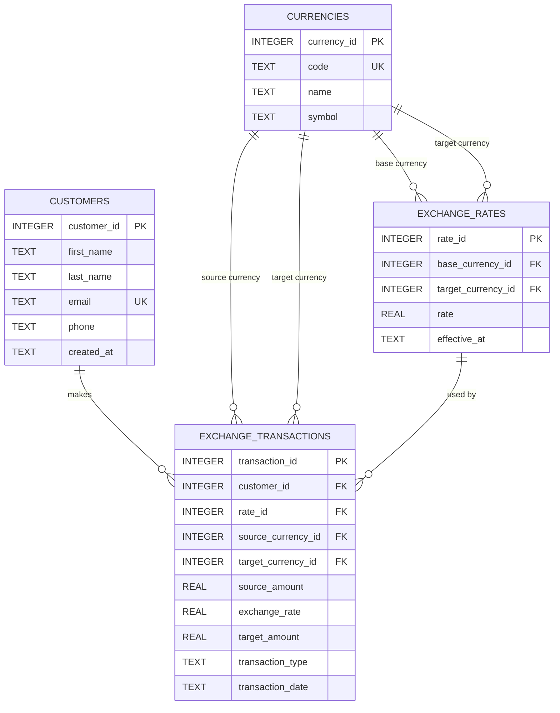

# Money Exchange System

## Project Overview

The Money Exchange System is an object-oriented database application for a currency exchange business. It manages customers, currencies, exchange rates, and currency exchange transactions.

The project uses:

- Python 3
- SQLite
- Object-oriented programming (OOP)
- `sqlite3` from the Python standard library
- `unittest` for automated tests
- Mermaid for the ER diagram

## Database Design

The database contains **4 tables**:

1. **customers**
   - Stores customer information.
   - A separate customer table is necessary because one customer can make many exchange transactions.

2. **currencies**
   - Stores supported currencies and their ISO 4217 currency codes.
   - A separate currency table avoids repeating currency names and symbols in every transaction.

3. **exchange_rates**
   - Stores the exchange rate between a base currency and a target currency at a particular time.
   - This table is necessary because exchange rates change over time and historical rates are required to preserve the rate used by previous transactions.

4. **exchange_transactions**
   - Stores each completed currency exchange.
   - It connects a customer, source currency, target currency, exchange rate, source amount, target amount, and transaction timestamp.
   - The exchange rate is stored directly in the transaction so that historical transactions remain accurate even after current rates change.

### Relationships

- One customer can have many exchange transactions.
- One currency can be used in many exchange transactions as a source currency.
- One currency can be used in many exchange transactions as a target currency.
- One currency can have many exchange-rate records as a base currency.
- One currency can have many exchange-rate records as a target currency.
- Each exchange transaction uses one exchange-rate record.

## ER Diagram



## OOP Design

The application is organized around classes:

- `DatabaseManager` handles SQLite connections, schema creation, and seed data.
- `Customer` represents a customer.
- `Currency` represents a supported currency.
- `ExchangeRate` represents an exchange rate.
- `ExchangeTransaction` represents a completed exchange.
- `CustomerRepository` manages customer persistence.
- `CurrencyRepository` manages currency persistence.
- `ExchangeRateRepository` manages exchange-rate persistence.
- `ExchangeTransactionRepository` manages transaction persistence.
- `MoneyExchangeService` contains the business logic for creating customers, managing rates, calculating exchanges, and recording transactions.

This separation keeps database operations and business rules independent and demonstrates OOP principles such as encapsulation, abstraction, and separation of responsibilities.

## Project Structure

```text
money_exchange_system/
├── README.md
├── requirements.txt
├── .gitignore
├── schema.sql
├── main.py
├── data/
│   └── .gitkeep
├── docs/
│   └── er_diagram.md
├── src/
│   ├── __init__.py
│   ├── database.py
│   ├── models.py
│   ├── repositories.py
│   └── services.py
└── tests/
    ├── __init__.py
    └── test_money_exchange.py
```

## How to Run

### 1. Create a virtual environment

```bash
python3 -m venv .venv
source .venv/bin/activate
```

On Windows:

```powershell
.venv\Scripts\activate
```

### 2. Install dependencies

```bash
pip install -r requirements.txt
```

The project currently uses only the Python standard library, so `requirements.txt` is intentionally empty.

### 3. Run the application

```bash
python main.py
```

The application creates `data/money_exchange.db` automatically.

### 4. Run tests

```bash
python -m unittest discover -s tests -v
```

## Example Business Flow

1. Create a customer.
2. Add supported currencies such as USD, NZD, EUR, and AUD.
3. Add an exchange rate.
4. Request an exchange calculation.
5. Record the completed transaction.
6. Query the customer's transaction history.

## Data Integrity

The database uses:

- Primary keys for entity identification.
- Foreign keys for relationships.
- Unique constraints for customer email and currency code.
- Check constraints for positive monetary amounts and exchange rates.
- ISO-style three-letter currency codes.
- Stored transaction exchange rates to preserve historical accuracy.

## Example

If a customer exchanges 100 USD into NZD at a rate of 1.68:

```text
Source amount: 100.00 USD
Exchange rate: 1.680000
Target amount: 168.00 NZD
```

The transaction stores `1.68` as the exchange rate used at the time of the transaction, even if the current USD/NZD rate later changes.

## GitHub

After creating the repository, push this project to GitHub and add the repository URL here.

Example:

```text
https://github.com/<your-username>/money-exchange-system
```
