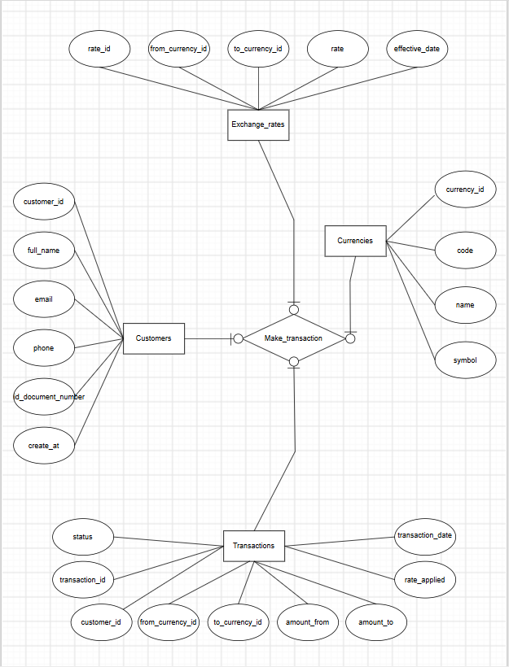

# Money Exchange System — Database Project

**Week 3 — Activity 5**

A small currency exchange business needs to manage customers, the currencies
it trades in, the rates it trades at, and the transactions it processes.
This project designs and implements that database using an
object-oriented (OOP) application layer in Python on top of SQLite.

## ER Diagram




## Contents

- [`er_diagram.md`](er_diagram.md) — Entity-Relationship diagram (Mermaid)
- [`src/database.py`](src/database.py) — schema definition + connection manager
- [`src/models.py`](src/models.py) — OOP entity classes (`Customer`, `Currency`, `ExchangeRate`, `Transaction`)
- [`src/repositories.py`](src/repositories.py) — one repository class per table (CRUD)
- [`src/services.py`](src/services.py) — `ExchangeService`, the business-logic layer
- [`seed_data.py`](seed_data.py) — populates sample data
- [`main.py`](main.py) — runnable demo
- [`tests/test_exchange.py`](tests/test_exchange.py) — unit tests

## How many tables, and why

The database has **4 tables**. The brief asked for at least three; a fourth
(`exchange_rates`) was added because folding rates into another table would
either duplicate data or make historical rates impossible to track — both
violate basic normalization.

### 1. `customers`
Stores the people who bring in money to exchange: name, email, phone, and an
ID document number (required for KYC/compliance in real exchange
businesses). This table is necessary because a transaction must always be
traceable back to the person who made it, and customer details (contact
info, ID) shouldn't be repeated on every transaction row — that would be
duplicated, error-prone data. Keeping customers separate also lets the
business look up a person's full exchange history in one query.

### 2. `currencies`
Stores each currency the business trades in (ISO code, name, symbol —
e.g. `USD`, `US Dollar`, `$`). This table is necessary because currencies
are referenced from two different places (`exchange_rates` and
`transactions`), each potentially twice (a "from" side and a "to" side). If
currency names were typed out as plain text every time, a typo like `usd`
vs `USD` would silently create a data-integrity bug. A dedicated table
with a foreign key guarantees every reference points to a real, consistently
spelled currency.

### 3. `exchange_rates`
Stores the rate for converting one currency to another, with a timestamp
(`effective_date`). This table is necessary because exchange rates change
constantly and the business needs a *history* of rates, not just the
current one — for auditing, reporting, and recalculating past transactions.
Storing the rate directly on the customer or currency table would only
allow one rate to exist at a time and would lose that history.

### 4. `transactions`
Stores each actual exchange event: which customer, which currency was sold
and which was bought, how much, at what rate, and when. This is the
"transaction" the whole system exists to record. It's necessary as its own
table because it's the many-to-many meeting point of customers and
currencies — one customer can have many transactions, and one currency can
appear in many transactions (on either side) — and each transaction needs
its own timestamp, amount, and status, which don't belong to any other
entity.

## Why this counts as OOP, not just a script

- **Encapsulation** — each table has a matching class (`Customer`,
  `Currency`, `ExchangeRate`, `Transaction`) that owns its own data and
  validation (e.g. `Transaction` calculates `amount_to` itself and rejects
  a non-positive amount in `__post_init__`).
- **Separation of concerns** — `Database` only knows about connections and
  schema; `repositories.py` only knows SQL; `services.py` only knows
  business rules (`ExchangeService.perform_exchange`); `models.py` only
  knows what a row *is*. Nothing outside `repositories.py` writes raw SQL.
- **Abstraction** — `BaseRepository` defines the interface every repository
  must implement, so each concrete repository (`CustomerRepository`,
  `CurrencyRepository`, etc.) is interchangeable at that interface level.
- **Composition** — `ExchangeService` is composed of four repositories
  rather than inheriting from them, and coordinates them to perform one
  real-world action.

## Entity-Relationship diagram

See [`er_diagram.md`](er_diagram.md) for the full Mermaid ER diagram
(renders automatically on GitHub). Summary of relationships:

- One **customer** can make many **transactions** (1:N)
- One **currency** can be the "from" or "to" side of many **exchange rates** (1:N, twice)
- One **currency** can be the "from" or "to" side of many **transactions** (1:N, twice)

## How to run it

Requires Python 3.9+ (standard library only — no dependencies to install).

```bash
git clone <your-repo-url>
cd money-exchange-db

# 1. Create the schema and load sample data
python seed_data.py

# 2. Run the demo (performs a sample exchange and lists all transactions)
python main.py

# 3. Run the unit tests
python -m unittest tests/test_exchange.py -v
```

Example output from `main.py`:

```
Customer: Alice Nguyen (alice@example.com)
Exchanged 500 NZD -> 300.0 USD at rate 0.6 (txn #1)

All transactions on record:
  #1: customer 1 | 500.0 -> 300.0 @ 0.6 | 2026-08-28 05:49:11
```

## Notes

- Uses SQLite for simplicity and portability (no server setup needed to run
  or mark this assignment); the schema in `src/database.py` uses standard
  SQL and would need only minor syntax changes to run on MySQL/PostgreSQL
  (e.g. `AUTOINCREMENT` → `AUTO_INCREMENT`/`SERIAL`).
- Sample exchange rates in `seed_data.py` are illustrative, not live market
  data.
