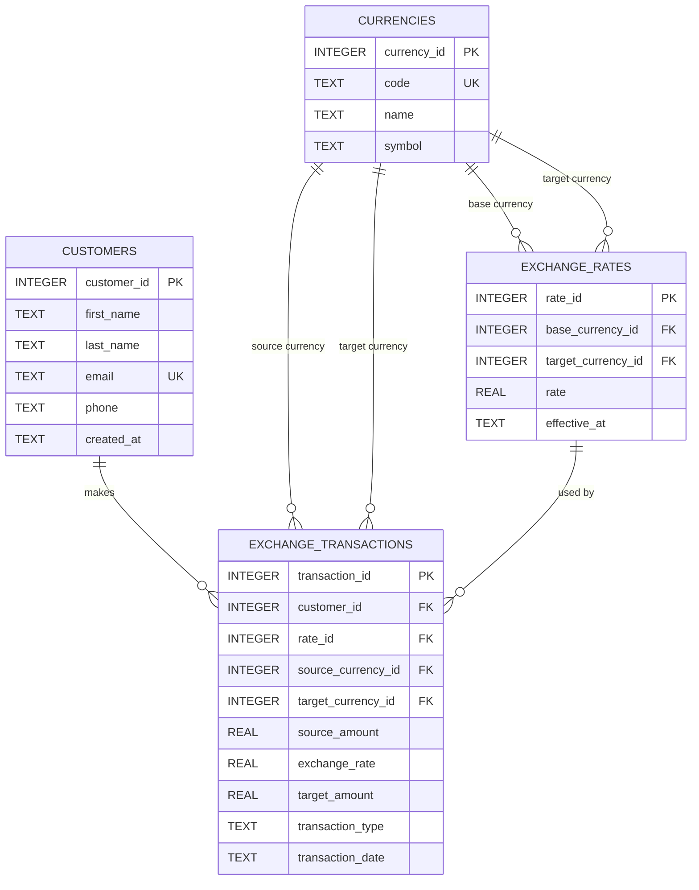

# Entity Relationship Diagram

The Money Exchange System contains four database entities.

```mermaid
erDiagram
    CUSTOMERS ||--o{ EXCHANGE_TRANSACTIONS : makes
    CURRENCIES ||--o{ EXCHANGE_TRANSACTIONS : "source currency"
    CURRENCIES ||--o{ EXCHANGE_TRANSACTIONS : "target currency"
    CURRENCIES ||--o{ EXCHANGE_RATES : "base currency"
    CURRENCIES ||--o{ EXCHANGE_RATES : "target currency"
    EXCHANGE_RATES ||--o{ EXCHANGE_TRANSACTIONS : "used by"

    CUSTOMERS {
        INTEGER customer_id PK
        TEXT first_name
        TEXT last_name
        TEXT email UK
        TEXT phone
        TEXT created_at
    }

    CURRENCIES {
        INTEGER currency_id PK
        TEXT code UK
        TEXT name
        TEXT symbol
    }

    EXCHANGE_RATES {
        INTEGER rate_id PK
        INTEGER base_currency_id FK
        INTEGER target_currency_id FK
        REAL rate
        TEXT effective_at
    }

    EXCHANGE_TRANSACTIONS {
        INTEGER transaction_id PK
        INTEGER customer_id FK
        INTEGER rate_id FK
        INTEGER source_currency_id FK
        INTEGER target_currency_id FK
        REAL source_amount
        REAL exchange_rate
        REAL target_amount
        TEXT transaction_type
        TEXT transaction_date
    }
```
