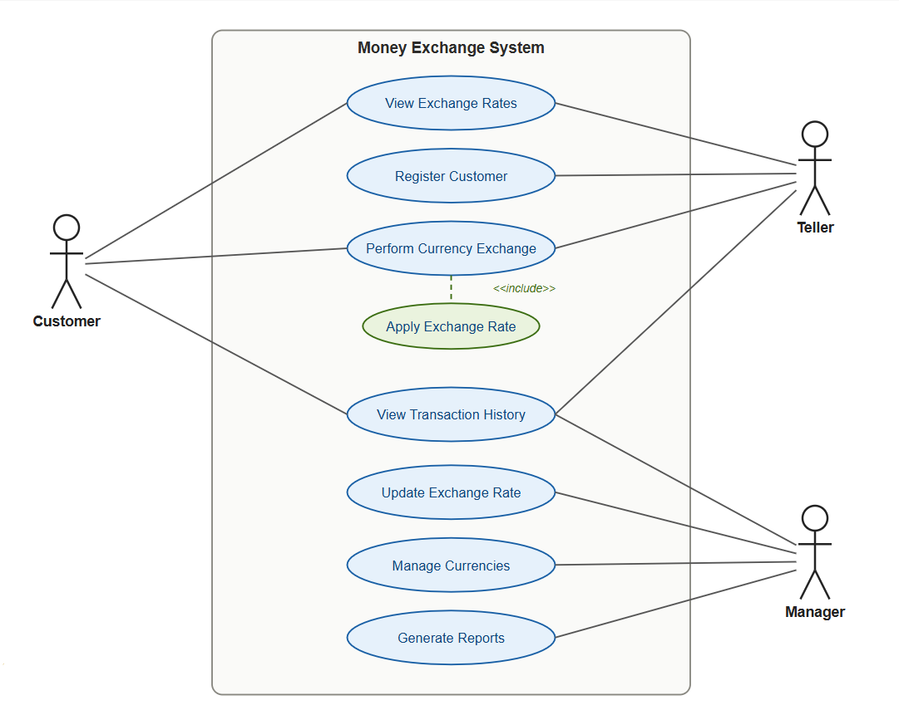

# Use Case Diagram — Money Exchange System

**Week 4 — Activity 1.1**

This document describes the use case diagram for the Money Exchange System
first modeled in Week 3 — Activity 5 (see the main [README](../README.md)
for the database design it maps onto).

*(If the image doesn't render in your viewer, open
[`use_case_diagram.svg`](use_case_diagram.png) directly.)*

## Actors

| Actor | Description |
|---|---|
| **Customer** | The person bringing money in to exchange. Interacts with the front-of-house side of the system: checking rates, requesting an exchange, and reviewing their own past transactions. |
| **Teller** | The staff member at the counter who serves customers face-to-face. Registers new customers and processes the actual exchange transactions on the system. |
| **Manager** | Back-office staff responsible for keeping the business's data current and correct: updating exchange rates, adding/removing supported currencies, and pulling reports. |

Only human actors are needed here — there's no external system (e.g. a
live market-rate feed) in this scope, since Week 3's design uses
rates entered directly into the `exchange_rates` table.

## Use cases

| Use case | Primary actor(s) | Description |
|---|---|---|
| **View exchange rates** | Customer, Teller | Look up the current rate between two currencies before committing to an exchange. |
| **Register customer** | Teller | Create a new `customers` record (name, email, phone, ID document) the first time someone visits. |
| **Perform currency exchange** | Customer, Teller | The core use case: convert an amount from one currency to another. The customer initiates the request; the teller processes and confirms it. This creates a new row in `transactions`. |
| **Apply exchange rate** *(included by "Perform currency exchange")* | — (system-level) | Look up the latest applicable rate from `exchange_rates` and use it to calculate the converted amount. Modeled as an `<<include>>` because every exchange must do this — it's not optional behaviour, it's a mandatory sub-step. |
| **View transaction history** | Customer, Teller, Manager | Customers see their own past exchanges; tellers and managers can look up any customer's history for service or audit purposes. |
| **Update exchange rate** | Manager | Add a new rate entry for a currency pair (e.g. when the market moves). Because `exchange_rates` is timestamped, this always *adds* a new row rather than overwriting history. |
| **Manage currencies** | Manager | Add a new currency the business now supports, or retire one it no longer trades. |
| **Generate reports** | Manager | Produce summaries (e.g. daily transaction volume, most-traded currency pairs) from the `transactions` table for business oversight. |

## Relationships shown

- **Association** (solid line): a direct interaction between an actor and a
  use case — e.g. Customer — View Exchange Rates.
- **`<<include>>`** (dashed line): Perform Currency Exchange always includes
  Apply Exchange Rate. This is the one non-optional sub-behaviour in the
  system, so it's modeled explicitly rather than left implicit.

## How this maps to the Week 3 database

Each use case reads from or writes to the tables designed in Week 3:

- *View exchange rates* / *Update exchange rate* → `exchange_rates`
- *Register customer* → `customers`
- *Perform currency exchange* / *Apply exchange rate* → `transactions`
  (write) + `exchange_rates` (read) + `customers` (read)
- *View transaction history* / *Generate reports* → `transactions`
- *Manage currencies* → `currencies`

This is also reflected in the code: `ExchangeService.perform_exchange()` in
[`src/services.py`](../src/services.py) is the concrete implementation of
the "Perform currency exchange" (+ its included "Apply exchange rate")
use case.
