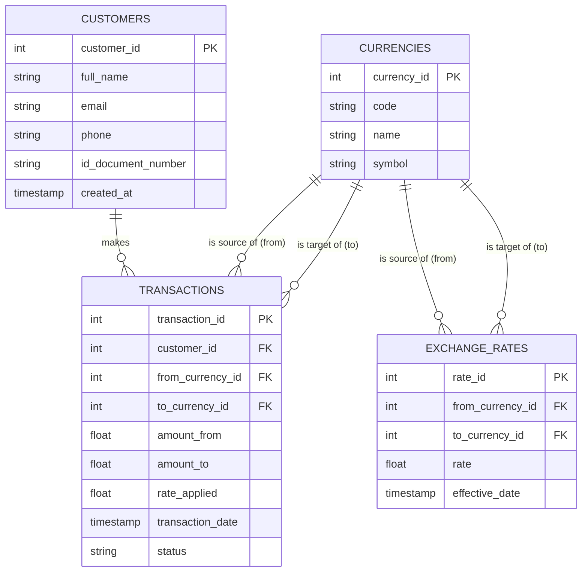

# Entity-Relationship Diagram

This diagram is written in [Mermaid](https://mermaid.js.org/) syntax and
renders automatically when viewed on GitHub.

## Relationships summary

| Relationship | Cardinality | Meaning |
|---|---|---|
| Customer → Transaction | 1 : N | One customer can make many exchange transactions |
| Currency → ExchangeRate (from) | 1 : N | A currency can appear as the "from" side of many rates |
| Currency → ExchangeRate (to) | 1 : N | A currency can appear as the "to" side of many rates |
| Currency → Transaction (from/to) | 1 : N | A currency can appear as the "from" or "to" side of many transactions |
