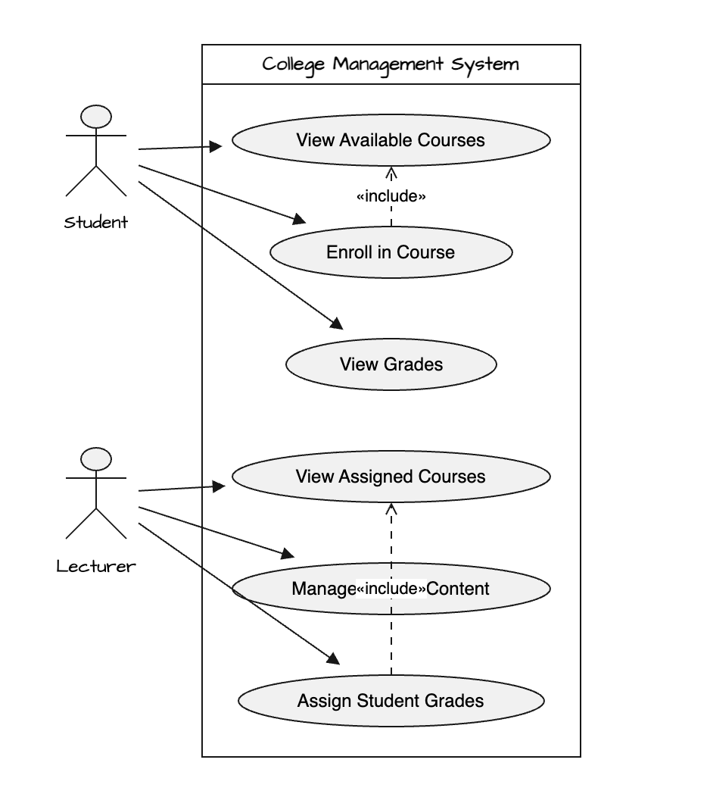
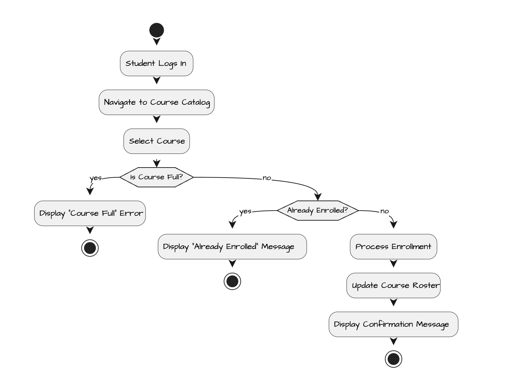
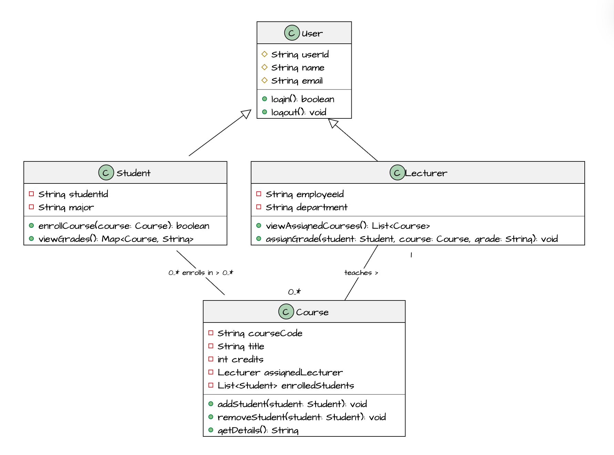

## Week 5 - Activity 1: College project
    ```
    Develop a Use Case Diagram, Activity Diagram, and Class Diagram for a simple college management project involving lecturers, students, and courses.
    The scope of the project should be limited to these three areas. Once completed, upload your diagrams along with a brief description of your design to GitHub and share the GitHub repository link.
    ```

**Scope**: A lightweight college management module focused strictly on student course enrollment, lecturer course assignments, and grade reporting.

#### Module Breakdown
- **Students**: View available courses, enroll in courses, and view their official grades.

- **Lecturers**: View assigned courses, manage course content/schedules, and assign grades to enrolled students.

- **Courses**: Maintain course details (ID, title, credits) and track assigned lecturers and enrolled students.

#### Use Case Diagram



#### Activity Diagram



#### Class Diagram




#### [Draw.io Link](https://yoobeestudent-team-e08zm265.atlassian.net/wiki/pages/resumedraft.action?draftId=1146881&draftShareId=1a339e56-4c7c-46ab-b045-d27d40cbf855)